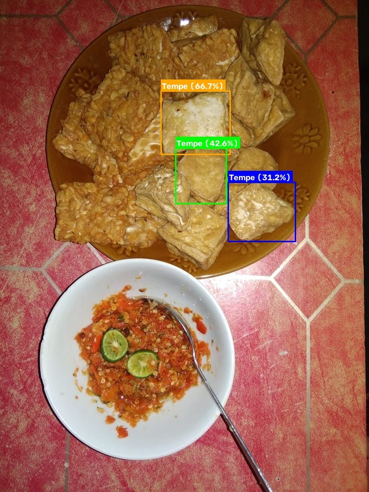
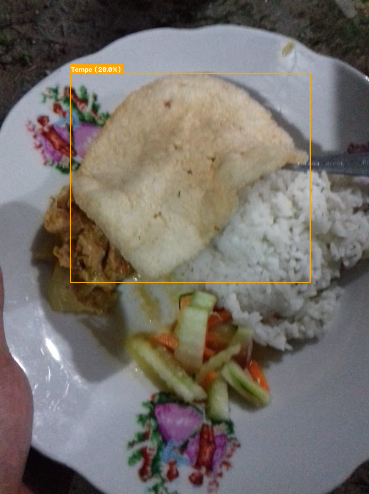
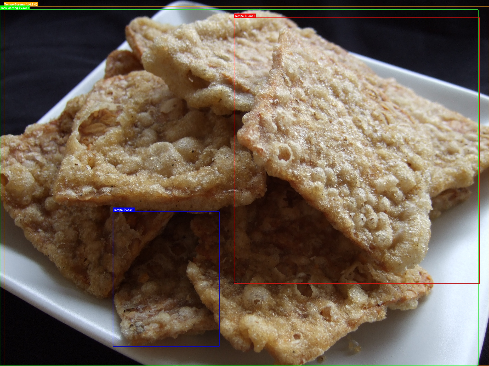

# Laporan Eksperimen: Deteksi Bahan Makanan Berbasis YOLO-World & Roadmap Fine-Tuning

* **ID Dokumen**: R01-FOOD-DETECTION-YOLO
* **Tanggal**: 18 September 2026
* **Author**: Nadhif
* **Status**: Selesai (Fase Proof of Concept - Deteksi Objek)

---

## 1. Ringkasan Eksekutif

Pada tahap awal pengembangan modul AI/ML untuk Nusagizi, tim memprioritaskan penggunaan pendekatan **Computer Vision murni (YOLO)** untuk mendeteksi bahan makanan dari foto kamera (fitur mirip *Locket*). 

Eksperimen ini berhasil membuktikan bahwa kita dapat melakukan deteksi bahan makanan lokal Indonesia (seperti tempe, tahu, nasi, telur) secara **langsung tanpa memerlukan anotasi manual data dari nol** menggunakan model **YOLO-World (Zero-Shot Open-Vocabulary Object Detection)**. Inferensi berjalan secara *real-time* di lingkungan lokal CPU Mac (~250–300 ms).

Laporan ini juga menegaskan batasan model saat ini serta menetapkan langkah selanjutnya untuk melakukan **fine-tuning terarah di Google Colab** dan integrasi **perhitungan gizi Kemenkes RI**.

---

## 2. Latar Belakang & Masalah

Fitur Locket di Nusagizi dirancang untuk memotret makanan anak (usia 6 bulan hingga 5 tahun). Secara ideal, sistem ML diharapkan melakukan tiga hal:
1. Mendeteksi jenis & bahan makanan yang ada pada foto.
2. Memperkirakan porsi/jumlah makanan (gramatur atau Ukuran Rumah Tangga / URT).
3. Menganalisis kecukupan nilai gizi berdasarkan standar Kementerian Kesehatan RI (AKG Balita).

Tantangan utama yang dihadapi adalah:
* **Model YOLO Klasik (COCO)** hanya memiliki 80 kelas umum dan tidak mengenal makanan khas Indonesia seperti tempe, tahu goreng, atau bubur tim.
* **Proses labeling manual** dari ribuan foto membutuhkan waktu dan biaya besar.

---

## 3. Solusi yang Diterapkan

Kami mengimplementasikan dua jalur solusi:

### A. Solusi 1: Zero-Shot YOLO-World (Implementasi Aktif)
* Menggabungkan *vision backbone* YOLOv8/YOLO11 dengan *text embeddings* berbasis CLIP.
* Daftar kelas dapat didefinisikan secara dinamis melalui kode (`set_classes`) tanpa perlu proses training maupun dataset berlabel.
* Mengintegrasikan pemetaan label lokal ke kategori gizi dasar (`protein_nabati`, `protein_hewani`, `karbohidrat`, `sayur`, `buah`).

### B. Solusi 2: Supervised Fine-Tuning Pipeline (Siap Dijalankan di Colab)
* Menyiapkan script otomatisasi `train_colab_roboflow.py` untuk melatih model YOLO pada dataset makanan Indonesia yang telah dilabeli oleh komunitas di Roboflow Universe.
* Menyediakan wrapper `CustomYOLODetector` di modul `src/` untuk memuat bobot model hasil training (`best.pt`).

---

## 4. Hasil Eksperimen & Validasi Visual

Pengujian dilakukan menggunakan script `demo_detect.py` terhadap beberapa sampel gambar makanan lokal:

| Gambar Sampel | Model | Confidence Thresh | Durasi Inferensi | Objek Terdeteksi | Kategori Terpetakan |
| :--- | :--- | :---: | :---: | :--- | :--- |
| `data/samples/tahu_tempe.jpg` | `yolov8s-worldv2.pt` | 0.15 | 295.42 ms | 5x Tempe (conf max: 66.7%) | `protein_nabati` |
| `data/samples/nasi_rames.jpg` | `yolov8s-worldv2.pt` | 0.15 | 254.74 ms | 1x Tempe (conf: 20.0%) | `protein_nabati` |
| `data/samples/tempe_goreng.jpg`| `yolov8s-worldv2.pt` | 0.08 | 268.44 ms | 4x Tempe/Tempe Goreng/Tahu | `protein_nabati` |

### Bukti Visual Deteksi Objek

Berikut adalah hasil visualisasi *bounding box* dan label yang dihasilkan langsung oleh model YOLO-World:

#### A. Kasus 1: Potongan Tahu & Tempe (`tahu_tempe.jpg`)
Model berhasil melokalisasi beberapa potongan tempe di atas piring dengan bounding box presisi dan tingkat keyakinan mencapai 66.7%:

#### B. Kasus 2: Nasi Rames Campur (`nasi_rames.jpg`)
Pada menu campur yang kompleks, model mengenali komponen tempe orek/kering tempe pada piring:

#### C. Kasus 3: Tempe Goreng Snack (`tempe_goreng.jpg`)
Dengan penyesuaian confidence threshold (0.08–0.12), model mampu melokalisasi area tempe goreng dan memisahkannya dari latar belakang:

---

## 5. Batasan Kritis Model Saat Ini

> [!IMPORTANT]
> **Hal yang Perlu Digarisbawahi:**
> 1. **Baru Sekadar Deteksi Objek Visual**: Model saat ini hanya mengenali *apa nama bahan makanan dan di mana lokasinya* pada foto.
> 2. **Belum Menghitung Nilai Gizi**: Model belum mengeluarkan data kalori (kkal), gram protein hewani, protein nabati, lemak, zat besi, maupun mikronutrien lainnya.
> 3. **Belum Menghitung Porsi / Gramasi**: Model belum mengukur volume atau berat gram porsi makanan (diperlukan referensi skala atau masukan URT orang tua di UI).
> 4. **Makanan Campur (Bubur MPASI Lumat)**: Makanan usia 6-8 bulan yang berbentuk bubur homogen masih sulit diurai per-bahan oleh deteksi visual 2D murni.

---

## 6. Arsitektur Kode & Pemanfaatan Direktori `src/`

Modul kode dibangun dengan arsitektur standar industri (*src-layout*):
* `src/nusagizi/detector/yolo_world.py`: Logika utama inferensi model YOLO-World, manajemen CLIP embedding, dan pemetaan metadata.
* `src/nusagizi/detector/custom_yolo.py`: Modul pemuat model custom (`best.pt`) hasil fine-tuning.
* `src/nusagizi/detector/base.py`: Interface abstrak dan utilitas penggambaran bounding box OpenCV.
* `src/nusagizi/schema.py`: Definisi struktur data Pydantic/Dataclass (`BoundingBox`, `DetectedIngredient`, `DetectionResult`).
* `demo_detect.py`: Runner CLI yang mengimpor modul-modul di dalam `src/nusagizi` untuk keperluan demonstrasi dan pengujian cepat.

---

## 7. Rencana Tindak Lanjut (Next Steps)

1. **Ekstraksi Dataset & Image Crawling**:
   - Memperluas crawler untuk mengumpulkan ratusan foto makanan balita dan menu Indonesia dari sumber daring (Unsplash, Wikimedia, atau Bing Image search).
2. **Fine-Tuning YOLO di Google Colab**:
   - Mengunduh dataset berlabel dari Roboflow Universe (*Indonesian Food Dataset*).
   - Menjalankan `train_colab_roboflow.py` pada GPU T4 untuk menghasilkan checkpoint `best.pt`.
3. **Pembangunan Modul Gizi & Porsi (Nutrition Engine)**:
   - Membuat modul pemetaan dari `DetectedIngredient` ke basis data TKPI (Tabel Komposisi Pangan Indonesia) Kemenkes.
   - Mengintegrasikan dialog konfirmasi takaran porsi (URT) pada UI Locket.
